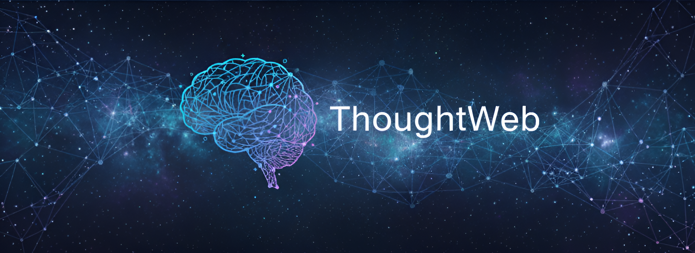

<div align="center">
<div align="center">
    
    
## Visualize and create your personal networks

</div>


</div>

## Description

ThoughtWeb is a web application that allows you to create and visualize your personal networks. You can add nodes representing different aspects of your life, such as education, work experience, hobbies, dreams, and family, and connect them to visualize relationships and dependencies.
<div align="center">


<div align="center">
    <a href="https://aashish-jha-11.github.io/MAP/" target="_blank">
        
    </a>
</div>

</div>


## How to Use It

1. **Start Your Mind Map**: Enter your name to create the main node.
2. **Add Nodes**: Click on nodes to select them, and use the action panel to add child nodes.
3. **Connect Nodes**: Enable connect mode to link nodes together.
4. **Edit Nodes**: Double-click on nodes to edit their labels.
5. **Save and Load**: Use the top bar buttons to save your mind map to a file or load an existing one.

## How to Build It Locally

1. **Clone the repository**:
    ```sh
    git clone https://github.com/Aashish-Jha-11/MAP.git
    cd MAP
    ```

2. **Install dependencies**:
    ```sh
    npm install
    ```

3. **Start the development server**:
    ```sh
    npm start
    ```

4. **Build the project**:
    ```sh
    npm run build
    ```

## File Description

- `index.html`: The main HTML file for the application.
- `index.js`: The entry point for the React application.
- `App.js`: The main application component.
- `ThoughtWeb.js`: The core component for creating and visualizing the mind map.
- `ThoughtWeb.css`: The CSS file for styling the ThoughtWeb component.

## How Saving Works

ThoughtWeb allows you to save your mind map to local storage and download it as a JSON file. You can also load a previously saved mind map from a JSON file.
Signing in with Google saves it on the cloud using Supabase (PostgreSQL), so if you sign in on any other device, it fetches your saved MindMap no matter where you saved it.

## Open Source Contributions

We welcome contributions from the community. Feel free to fork the repository, make changes, and submit a pull request.

## Acknowledgements

- I would like to thank Dr. Edward Rogers for his session on importance of a thought map like such in life, it was a huge inspiration behind this project.

- Also, I would love to thank my undiagnosed ADHD for impulsively jumping on the idea as soon as the session ended.

- This project has been rebuilt with Supabase instead of Firebase for better open-source compatibility and a generous free tier.

## License

This project is licensed under the MIT License. See the [LICENSE](LICENSE) file for details.
